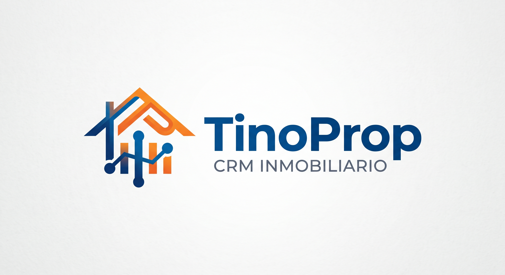

    

  

# **TINOPROP**

### CRM para la gestión de inmobiliarias

 

---

### **TRABAJO DE FIN DE GRADO**

#### Desarrollo de Aplicaciones Multiplataforma

---

   

**Autor**

### Valentín Antonio De Gennaro

 

**Curso académico**

### 2026 / 2027

  

**Centro educativo**

### CEAC Formación Profesional

      

---

**Tecnologías**

`PHP` · `MySQL` · `HTML` · `CSS` · `JavaScript`

  

**Fecha de entrega**

2027

   

------------------------------------------------------------------------

# 1. Introducción

En la introducción debéis presentar brevemente el proyecto y permitir que una persona que no lo conozca comprenda qué vais a desarrollar, qué problema pretende resolver y cuál será el alcance general del trabajo.

Intentad responder, de forma resumida, a cuestiones como:

- ¿En qué consiste el proyecto?
- ¿Qué necesidad o problema pretende resolver?
- ¿A qué usuarios, clientes o entidades va dirigido?
- ¿Qué tipo de solución vais a desarrollar?
- ¿Cuáles son sus principales funcionalidades?
- ¿Qué tecnologías o recursos principales vais a utilizar?
- ¿Cómo se organizará el resto de la memoria?

La introducción debe funcionar como una visión general del documento. No es necesario entrar todavía en detalles técnicos; esos aspectos se desarrollarán en los apartados posteriores.

Como orientación, una extensión aproximada de una página suele ser suficiente.

------------------------------------------------------------------------

# 2. Identificación de necesidades del sector productivo

El primer resultado de aprendizaje consiste en **identificar necesidades del sector productivo y relacionarlas con proyectos que puedan satisfacerlas**.

En esta primera parte debéis demostrar que vuestro proyecto no aparece de forma aislada: existe un contexto profesional, unas empresas, unos usuarios y unas necesidades que justifican la solución que proponéis.

## 2.1. Empresas del sector por sus características organizativas y por el producto o servicio que ofrecen

Investigad empresas que desarrollen productos o presten servicios relacionados con vuestro proyecto.

No se trata únicamente de hacer una lista de empresas. Debéis observar qué hacen, qué tipo de productos o servicios ofrecen, a qué clientes se dirigen y qué características relevantes presentan.

El objetivo es conocer el sector en el que se situaría vuestro proyecto y disponer de referencias reales con las que poder compararlo.

Podéis estudiar, por ejemplo:

- actividad principal;
- productos y servicios;
- público objetivo;
- tamaño o ámbito de actuación;
- modelo de negocio;
- tecnologías utilizadas cuando sean relevantes;
- características que diferencian a unas empresas de otras.

## 2.2. Empresas tipo: estructura organizativa y funciones de los departamentos

Escoged una o varias empresas representativas del sector y explicad cómo podría organizarse una empresa de ese tipo.

Debéis identificar sus principales departamentos o áreas y explicar qué función desempeña cada uno.

En una empresa de desarrollo de software podrían existir, por ejemplo, áreas de dirección, análisis, desarrollo, diseño, sistemas, calidad, soporte, comercial o administración. No todas las empresas tendrán necesariamente la misma estructura.

Lo importante es relacionar la organización descrita con la realidad del sector de vuestro proyecto.

## 2.3. Necesidades más demandadas a las empresas

A partir de la investigación anterior, identificad qué necesidades parecen demandar con mayor frecuencia los clientes o usuarios del sector.

Pensad en problemas reales que puedan resolverse mediante software: automatización de procesos, gestión de información, comunicación, comercio electrónico, educación, análisis de datos, movilidad, seguridad, entretenimiento, accesibilidad, etc.

No basta con afirmar que una necesidad existe. Siempre que sea posible, justificad por qué la consideráis relevante a partir de vuestro análisis del sector.

## 2.4. Oportunidades de negocio previsibles en el sector

Además de estudiar la situación actual, debéis analizar posibles oportunidades futuras.

Podéis considerar cambios tecnológicos, nuevas formas de consumo, transformación digital, inteligencia artificial, automatización, servicios en la nube, dispositivos móviles, nuevas necesidades empresariales o cualquier otra tendencia relacionada directamente con vuestro proyecto.

El objetivo es explicar si existe una oportunidad razonable para una solución como la que proponéis.

Evitad afirmaciones excesivamente generales. Relacionad las oportunidades detectadas con vuestro proyecto concreto.

## 2.5. Tipo de proyecto requerido para responder a las demandas previstas

Una vez identificada la necesidad, debéis justificar qué tipo de proyecto resulta adecuado para resolverla.

Por ejemplo:

- aplicación web;
- aplicación multiplataforma;
- aplicación móvil;
- aplicación de escritorio;
- videojuego;
- servicio de red;
- plataforma cliente-servidor;
- sistema de gestión;
- API o servicio web;
- solución que combine varias de las anteriores.

Explicad por qué habéis elegido esa solución y no otra.

Podéis responder preguntas como: ¿necesita funcionar desde un navegador?, ¿requiere instalación?, ¿debe funcionar en varios dispositivos?, ¿necesita almacenar datos?, ¿existirán distintos tipos de usuario?, ¿necesita un servidor?, ¿debe integrarse con otros sistemas?

## 2.6. Características específicas del proyecto según los requerimientos

Transformad las necesidades detectadas en características concretas del proyecto.

Por ejemplo, si los usuarios necesitan acceder desde cualquier dispositivo, una característica podría ser disponer de una interfaz web adaptable. Si necesitan conservar información, el proyecto deberá incorporar persistencia de datos. Si existen distintos perfiles, será necesario implementar autenticación, autorización y gestión de permisos.

Intentad diferenciar entre:

- requisitos funcionales: qué debe hacer el sistema;
- requisitos no funcionales: seguridad, rendimiento, usabilidad, compatibilidad, disponibilidad, accesibilidad, mantenibilidad, etc.;
- condicionantes técnicos o externos.

Este apartado debe permitir comprender qué tendrá que cumplir el proyecto para responder realmente a la necesidad identificada.

## 2.7. Obligaciones fiscales, laborales y de prevención de riesgos y condiciones de aplicación

Analizad qué obligaciones serían aplicables si el proyecto se desarrollara en un contexto profesional real.

No es necesario convertir este apartado en un tratado jurídico. Debéis identificar las obligaciones que tengan relación con vuestro caso y explicar brevemente cómo afectarían al proyecto.

Según el proyecto, pueden existir aspectos relacionados con:

- actividad empresarial y facturación;
- contratación de personal;
- prevención de riesgos laborales;
- propiedad intelectual y licencias;
- protección de datos;
- condiciones de uso de servicios de terceros;
- otras obligaciones específicas de la actividad.

Si alguna cuestión no resulta aplicable, podéis indicarlo y justificarlo.

## 2.8. Posibles ayudas o subvenciones para la incorporación de nuevas tecnologías

Investigad si un proyecto de estas características podría acogerse a ayudas, programas de digitalización, emprendimiento, innovación o incorporación de nuevas tecnologías.

No es imprescindible que exista una ayuda concreta aplicable. Si no encontráis ninguna adecuada, indicadlo razonadamente.

Lo importante es demostrar que habéis considerado la posibilidad de financiación o apoyo externo.

## 2.9. Guion de trabajo para la elaboración del proyecto

Cerrad esta primera fase explicando, de manera general, cómo vais a abordar el proyecto.

Este guion será una primera visión del trabajo que posteriormente desarrollaréis con mayor detalle en la planificación.

Indicad las grandes etapas previstas: análisis, diseño, preparación del entorno, implementación, pruebas, documentación, despliegue, evaluación, etc., adaptándolas a vuestro proyecto.

------------------------------------------------------------------------

# 3. Diseño del proyecto

El segundo resultado de aprendizaje consiste en **diseñar el proyecto desarrollando explícitamente las fases que lo componen**.

En esta parte ya no nos centramos tanto en justificar que existe una necesidad, sino en definir de forma concreta la solución que pretendemos desarrollar y comprobar que es viable.

## 3.1. Información relativa a los aspectos que van a ser tratados en el proyecto

Describid con detalle los elementos que compondrán vuestra solución.

Podéis explicar:

- usuarios o perfiles;
- módulos principales;
- funcionalidades;
- arquitectura general;
- información que manejará el sistema;
- componentes de cliente y servidor;
- integraciones externas;
- mecanismos de autenticación;
- interfaces principales;
- despliegue previsto.

El objetivo es descomponer la idea general en partes suficientemente claras como para poder planificar después su desarrollo.

## 3.2. Estudio de viabilidad técnica

Debéis justificar que el proyecto puede realizarse con los conocimientos, tecnologías, recursos y tiempo disponibles.

Un proyecto final debe ser suficientemente completo para demostrar las competencias adquiridas, pero también debe ser realizable.

Analizad, entre otros aspectos:

- complejidad técnica;
- tecnologías necesarias;
- conocimientos disponibles y conocimientos que será necesario adquirir;
- disponibilidad de hardware y software;
- servicios externos necesarios;
- limitaciones;
- riesgos técnicos;
- tiempo disponible.

No planteéis un proyecto cuyo alcance sea imposible de asumir. Es preferible desarrollar correctamente un producto con un alcance razonable que proponer un sistema enorme que finalmente no pueda completarse.

## 3.3. Fases del proyecto, contenido y plazos de ejecución

Dividid el proyecto en fases claramente identificables.

Para cada fase indicad:

- qué se pretende conseguir;
- qué tareas contiene;
- qué resultado o entregable producirá;
- cuándo comenzará;
- cuándo debería finalizar;
- de qué fases anteriores depende, cuando corresponda.

Podéis representar esta información mediante una tabla, cronograma o diagrama de Gantt.

La planificación debe ser coherente con el tiempo real disponible.

## 3.4. Objetivos y alcance

Definid los objetivos concretos que pretendéis alcanzar.

Los objetivos deben ser verificables. En lugar de escribir únicamente «crear una buena aplicación», es preferible establecer objetivos como «implementar un sistema de autenticación con dos perfiles de usuario», «permitir operaciones CRUD sobre los datos principales» o «desplegar la aplicación en un servidor accesible mediante navegador».

También debéis definir el **alcance**: qué incluye el proyecto y qué queda expresamente fuera.

Definir los límites es importante para evitar que el proyecto crezca de forma incontrolada durante su desarrollo.

## 3.5. Actividades necesarias para el desarrollo

Identificad las actividades necesarias para poder realizar el proyecto.

No confundáis necesariamente una actividad preparatoria con una fase funcional del software.

Por ejemplo:

- preparar el equipo de desarrollo;
- instalar herramientas;
- configurar un repositorio;
- contratar o preparar un servidor;
- registrar un dominio;
- crear cuentas de servicios externos;
- preparar datos iniciales;
- configurar entornos de pruebas;
- obtener recursos gráficos o multimedia.

Indicad únicamente aquellas actividades que sean relevantes para vuestro proyecto.

## 3.6. Recursos materiales y personales necesarios

Enumerad los recursos necesarios para desarrollar el proyecto.

### Recursos materiales y técnicos

Por ejemplo:

- ordenadores;
- servidores;
- dispositivos móviles;
- periféricos;
- alojamiento;
- dominio;
- software;
- sistemas operativos;
- entornos de desarrollo;
- bases de datos;
- servicios externos;
- licencias.

Aunque utilicéis software gratuito o de código abierto, sigue siendo un recurso y conviene identificarlo.

### Recursos personales

Indicad qué perfiles profesionales serían necesarios si el proyecto se realizara en un contexto empresarial real: desarrollo, diseño, sistemas, pruebas, dirección de proyecto, soporte, etc.

Si el proyecto académico lo realiza una sola persona, podéis indicarlo, pero debéis ser capaces de analizar qué recursos humanos requeriría una ejecución profesional equivalente.

## 3.7. Necesidades de financiación

Estimad si sería necesario disponer de financiación para poner en marcha el proyecto.

Considerad costes como:

- hardware;
- licencias;
- alojamiento;
- dominios;
- servicios externos;
- publicación en plataformas;
- contratación de profesionales;
- promoción;
- mantenimiento inicial.

Si el proyecto puede ponerse en marcha con una inversión reducida, explicadlo. Si no necesita financiación externa, indicad igualmente por qué.

## 3.8. Documentación necesaria para el diseño

Indicad qué documentación necesitáis consultar o preparar para diseñar correctamente el proyecto.

Puede incluir:

- requisitos;
- documentación técnica de lenguajes y frameworks;
- documentación de APIs;
- modelos de datos;
- diagramas;
- especificaciones funcionales;
- normativa aplicable;
- licencias;
- manuales de servicios externos;
- criterios de accesibilidad, seguridad o protección de datos cuando correspondan.

La finalidad de este apartado es demostrar que el diseño no se realiza únicamente por intuición, sino apoyándose en información y documentación adecuada.

## 3.9. Aspectos que se deben controlar para garantizar la calidad

Definid qué entenderéis por calidad en vuestro proyecto.

Podéis establecer criterios relacionados con:

- cumplimiento de requisitos;
- funcionamiento correcto;
- ausencia de errores graves;
- usabilidad;
- accesibilidad;
- seguridad;
- rendimiento;
- compatibilidad;
- calidad del código;
- mantenibilidad;
- documentación;
- pruebas realizadas.

Los indicadores deben poder comprobarse posteriormente.

------------------------------------------------------------------------

# 4. Planificación de la ejecución

El tercer resultado de aprendizaje consiste en **planificar la ejecución del proyecto, determinando el plan de intervención y la documentación asociada**.

Ahora debéis convertir el diseño anterior en un plan de trabajo ejecutable.

## 4.1. Secuenciación de tareas según las necesidades de implementación

Desglosad el proyecto en tareas concretas y estableced su orden.

Por ejemplo, en una aplicación podría ser necesario diseñar primero el modelo de datos, preparar después la base de datos, implementar la lógica de negocio, desarrollar las interfaces y finalmente integrar y probar el conjunto.

En otros proyectos algunas tareas podrán realizarse en paralelo.

La secuencia debe responder a dependencias reales, no simplemente a un orden arbitrario.

## 4.2. Recursos y logística necesaria para cada tarea

Relacionad las tareas principales con los recursos que necesitan.

Una tarea de despliegue puede necesitar un servidor; una prueba móvil puede requerir dispositivos o emuladores; una integración puede necesitar credenciales de una API; una fase de diseño puede necesitar determinadas herramientas.

La pregunta que debéis responder es: **¿qué necesito tener preparado para poder ejecutar correctamente cada tarea?**

## 4.3. Permisos y autorizaciones

Analizad si alguna tarea requiere permisos o autorizaciones.

Pueden existir, por ejemplo:

- permisos de acceso a sistemas de una empresa;
- autorización para utilizar determinados datos;
- credenciales para servicios externos;
- permisos para publicar una aplicación;
- consentimiento para realizar pruebas con usuarios;
- licencias de uso de recursos.

Si no necesitáis permisos especiales, indicadlo y justificadlo.

No debéis afirmar que una autoridad concreta debe autorizar un tratamiento de datos salvo que realmente exista ese requisito legal para vuestro caso; lo importante es identificar correctamente las obligaciones y permisos aplicables.

## 4.4. Procedimientos para la ejecución de las tareas

Explicad qué procedimientos utilizaréis para trabajar de forma ordenada.

Por ejemplo:

- control de versiones;
- estrategia de ramas;
- copias de seguridad;
- revisión de código;
- nomenclatura;
- gestión de versiones;
- pruebas antes de integrar cambios;
- procedimiento de despliegue;
- registro de tareas;
- validación de entregables.

No todos los proyectos necesitan los mismos procedimientos. Seleccionad los que aporten valor a vuestro caso.

## 4.5. Riesgos inherentes a la ejecución y plan de prevención

Identificad los riesgos asociados al proyecto y explicad cómo los reduciréis.

Además de los riesgos propios del trabajo con equipos informáticos ---ergonomía, fatiga visual, riesgos eléctricos cuando se manipula hardware, etc.--- podéis considerar riesgos del propio proyecto:

- pérdida de información;
- fallo de hardware;
- indisponibilidad de servicios;
- errores de configuración;
- problemas de seguridad;
- retrasos;
- dependencia de tecnologías externas.

Para cada riesgo relevante podéis indicar su probabilidad, impacto, medidas preventivas y respuesta prevista.

## 4.6. Asignación de recursos materiales y humanos según los tiempos de ejecución

Relacionad la planificación temporal con los recursos.

Indicad qué recursos se necesitan en cada fase, durante cuánto tiempo y qué perfil profesional sería responsable en un escenario profesional.

Aunque el proyecto académico sea individual, este ejercicio permite demostrar que sois capaces de planificar el proyecto desde una perspectiva profesional.

## 4.7. Valoración económica

Realizad una estimación razonable del coste del proyecto.

Debéis considerar tanto recursos materiales como humanos.

No asumáis que el coste es cero simplemente porque ya tenéis un ordenador o porque realizáis el proyecto como estudiantes. El objetivo es estimar cuánto costaría desarrollar una solución equivalente en un contexto profesional.

Podéis contemplar:

- amortización o adquisición de equipos;
- licencias;
- servidores y servicios;
- dominios;
- publicación;
- recursos gráficos o multimedia;
- horas de trabajo de los perfiles profesionales necesarios;
- otros gastos directamente relacionados.

Explicad los criterios utilizados para realizar los cálculos.

## 4.8. Documentación necesaria para la ejecución

Indicad qué documentos serán necesarios durante la ejecución.

Por ejemplo:

- especificación de requisitos;
- modelo de datos;
- diagramas;
- planificación;
- documentación de APIs;
- instrucciones de despliegue;
- plan de pruebas;
- registro de incidencias;
- control de cambios;
- documentación técnica.

No se trata de repetir toda la memoria, sino de identificar la documentación que sirve realmente de apoyo a la ejecución.

------------------------------------------------------------------------

# 5. Seguimiento y control

El cuarto resultado de aprendizaje consiste en **definir procedimientos para el seguimiento y control de la ejecución del proyecto, justificando las variables e instrumentos empleados**.

Un proyecto profesional no termina con una planificación inicial. Durante su desarrollo debemos comprobar si el trabajo avanza correctamente, registrar problemas, gestionar cambios y evaluar los resultados.

## 5.1. Procedimiento de evaluación de las actividades realizadas

Explicad cómo comprobaréis que cada tarea o fase ha finalizado correctamente.

Podéis establecer, por ejemplo:

- criterios de aceptación;
- revisión de requisitos;
- pruebas funcionales;
- revisión del código;
- comprobación del entregable;
- demostración de funcionamiento;
- lista de verificación.

Para cada tarea importante debería existir alguna forma objetiva de decidir si está realmente terminada.

## 5.2. Indicadores de calidad

Definid indicadores que permitan evaluar la calidad del proyecto.

Intentad que sean concretos y comprobables. Por ejemplo:

- porcentaje de requisitos implementados;
- número de pruebas superadas;
- errores abiertos y cerrados;
- tiempos de respuesta;
- compatibilidad con los entornos definidos;
- cumplimiento de criterios de accesibilidad;
- cobertura de documentación;
- incidencias detectadas por usuarios;
- cumplimiento de convenciones de código.

No es necesario utilizar todos estos indicadores. Elegid los que tengan sentido para vuestro proyecto y justificadlos.

## 5.3. Registro y evaluación de incidencias

Durante el desarrollo aparecerán errores, bloqueos, retrasos y cambios imprevistos.

Definid cómo vais a registrar las incidencias.

Un registro sencillo podría incluir:

- fecha;
- descripción;
- tarea afectada;
- gravedad o prioridad;
- causa;
- responsable;
- estado;
- solución aplicada;
- fecha de resolución.

El objetivo es que las incidencias no se resuelvan de forma informal sin dejar constancia de lo ocurrido.

## 5.4. Procedimiento para solucionar las incidencias

Explicad qué proceso seguiréis desde que se detecta una incidencia hasta que se considera resuelta.

Por ejemplo:

1. registrar la incidencia;
2. clasificar su prioridad;
3. reproducir y analizar el problema;
4. proponer una solución;
5. aplicar el cambio;
6. realizar pruebas;
7. documentar el resultado;
8. cerrar la incidencia.

Adaptad el procedimiento a vuestro proyecto.

## 5.5. Gestión y registro de cambios en recursos y tareas

La planificación inicial puede cambiar.

Puede ser necesario modificar una tecnología, ampliar o reducir una tarea, cambiar fechas, sustituir un servicio o redistribuir recursos.

Definid cómo registraréis estos cambios para poder comparar el plan inicial con lo que realmente ocurrió.

Para cada cambio podéis anotar:

- fecha;
- elemento modificado;
- situación inicial;
- modificación realizada;
- motivo;
- impacto en tiempo, coste o alcance;
- decisión adoptada.

## 5.6. Participación de los usuarios en la evaluación

Cuando sea posible, incorporad usuarios reales o representativos a la evaluación.

Podéis utilizar:

- pruebas de usuario;
- cuestionarios;
- entrevistas;
- observación;
- formularios de satisfacción;
- pruebas de usabilidad;
- sesiones de validación.

Explicad quién participaría, qué aspectos evaluaría y cómo registraríais los resultados.

Si vuestro proyecto no permite realizar pruebas con usuarios, justificadlo y plantead cómo podrían realizarse en un escenario real.

## 5.7. Cumplimiento del pliego de condiciones, cuando exista

Si el proyecto dispone de un pliego de condiciones, contrato, documento de requisitos o especificación formal, debéis definir cómo comprobaréis su cumplimiento.

Podéis utilizar una matriz de trazabilidad que relacione cada requisito con:

- la funcionalidad que lo implementa;
- la tarea en la que se desarrolla;
- la prueba que permite verificarlo;
- su estado final.

Si vuestro proyecto no dispone de un pliego de condiciones formal, indicadlo. Podéis utilizar como referencia equivalente vuestra propia especificación de requisitos y alcance.

------------------------------------------------------------------------

# 6. Conclusiones

Cerrad la memoria con una síntesis del proyecto realizado.

Las conclusiones deberían responder, al menos, a estas cuestiones:

- ¿se ha resuelto la necesidad inicialmente identificada?;
- ¿se han alcanzado los objetivos?;
- ¿qué resultado final se ha obtenido?;
- ¿cuáles han sido las principales dificultades?;
- ¿qué habéis aprendido?;
- ¿qué mejoras o ampliaciones podrían realizarse en el futuro?

Las conclusiones deben estar relacionadas con lo que realmente habéis desarrollado y con los objetivos establecidos al principio de la memoria.

------------------------------------------------------------------------

# 7. Bibliografía y fuentes consultadas

Incluid las fuentes que realmente hayáis utilizado durante el proyecto: documentación técnica, libros, artículos, normativa, manuales, documentación de lenguajes, frameworks, APIs, librerías o servicios.

Utilizad un formato coherente en todas las referencias.

No incluyáis fuentes que no hayan sido consultadas y diferenciad, cuando corresponda, entre bibliografía, documentación técnica y normativa.

------------------------------------------------------------------------

# Lista final de comprobación

Antes de entregar la memoria, comprobad que:

- habéis analizado empresas y necesidades reales del sector;
- habéis justificado el tipo de proyecto y sus requisitos;
- habéis definido objetivos y alcance;
- habéis realizado un estudio de viabilidad;
- habéis dividido el proyecto en fases y tareas;
- habéis establecido una planificación temporal;
- habéis identificado recursos materiales y humanos;
- habéis realizado una valoración económica;
- habéis contemplado riesgos, permisos y documentación;
- habéis definido procedimientos de ejecución;
- habéis establecido indicadores de calidad;
- habéis previsto cómo registrar incidencias y cambios;
- habéis explicado cómo evaluaréis el proyecto y, cuando proceda, cómo participarán los usuarios;
- habéis documentado las tecnologías empleadas;
- habéis realizado una autoevaluación y unas conclusiones coherentes;
- la memoria describe vuestro proyecto concreto y no contiene apartados genéricos sin relación con él.
